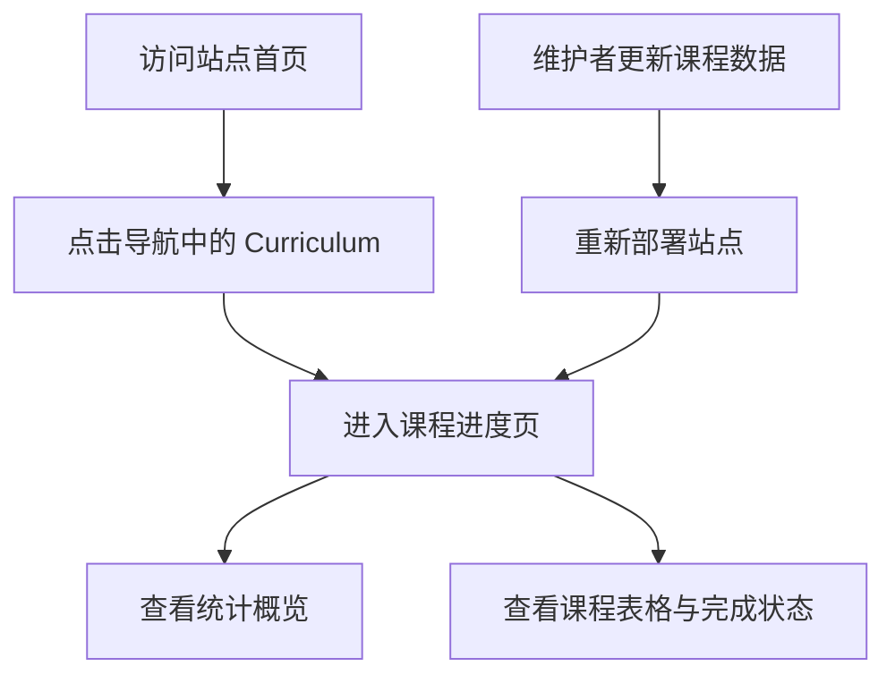

## 1. 产品概述
为个人学术主页新增一个“课程进度”子页面，用清晰的表格式界面追踪课程修读状态、完成情况与项目节点。
- 主要目标是让导师、合作者与本人可以快速查看课程完成进度，替代分散在 Obsidian 或截图中的手工记录。
- 页面部署在 `hlx9751.github.io` 站内，具备公开访问链接，便于与老师和 Nicolo 共享。

## 2. 核心功能

### 2.1 功能模块
1. **课程进度页**：页面头部说明、进度概览、课程清单、状态说明。

### 2.2 页面详情
| 页面名称 | 模块名称 | 功能说明 |
|---------|---------|---------|
| 课程进度页 | 页面头部 | 展示页面标题、副标题、更新时间与用途说明 |
| 课程进度页 | 统计概览 | 展示已完成课程数、进行中课程数、总课程数 |
| 课程进度页 | 课程表格 | 按课程编号、课程名称、状态展示课程，支持复选框式视觉标记 |
| 课程进度页 | 状态说明 | 解释已完成、进行中两类状态的含义 |

## 3. 核心流程
用户打开站点导航中的“Curriculum”，查看课程清单与状态概览；后续维护者只需编辑页面内的数据列表，即可更新展示内容。

## 4. 用户界面设计
### 4.1 设计风格
- 主色：温暖米色、深棕灰、橙金色强调，呼应你截图里的课程表视觉
- 按钮与卡片：圆角卡片、浅阴影、轻微描边
- 字体：沿用站点现有字体体系，标题加粗，数据与课程编号强调对齐
- 布局：桌面优先的单页信息面板，上方概览卡片，下方表格
- 图标风格：使用简洁状态图标，如 `✅`、`🔥`、`○`

### 4.2 页面设计概览
| 页面名称 | 模块名称 | UI 元素 |
|---------|---------|---------|
| 课程进度页 | 页面头部 | 大标题、副说明、浅色渐变背景、状态标签 |
| 课程进度页 | 统计概览 | 3 个信息卡片，显示总课程数、已完成、进行中 |
| 课程进度页 | 课程表格 | 三列表格，课程编号使用强调色，状态列使用胶囊标签 |
| 课程进度页 | 状态说明 | 轻量注释区，说明维护方式与更新时间 |

### 4.3 响应式
- 采用桌面优先设计
- 平板与手机上表格允许横向滚动
- 在窄屏下保持状态标签与课程标题可读性优先
