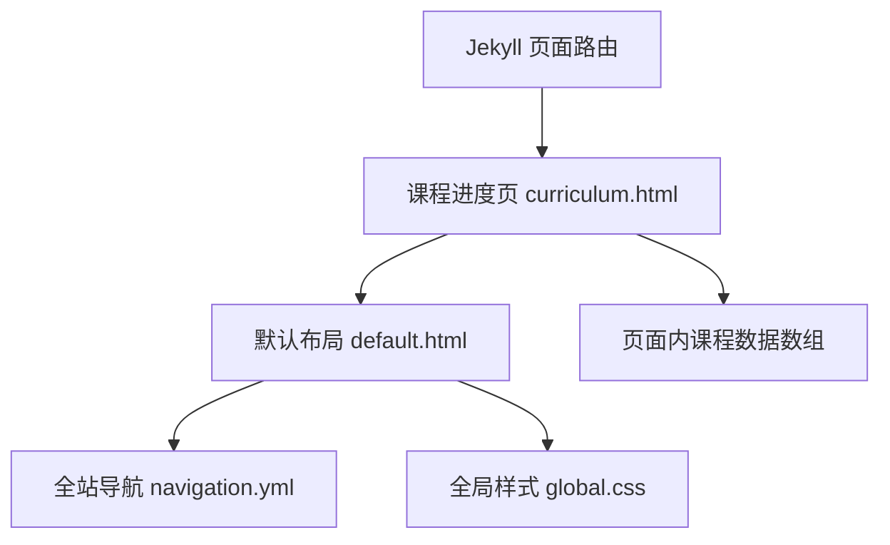

## 1. 架构设计


## 2. 技术描述
- 前端：Jekyll + Liquid + Bootstrap 4 + 自定义 CSS
- 页面形态：单独 HTML 页面，复用现有 `default` 布局
- 数据来源：首版直接内嵌在页面 front matter 之后的 Liquid 数据结构，后续可迁移到 `_data` 文件
- 导航：通过 `_data/navigation.yml` 增加新入口

## 3. 路由定义
| 路由 | 用途 |
|------|------|
| `/curriculum` | 展示课程修读进度与完成状态 |

## 4. API 定义
- 无后端 API
- 所有数据由静态页面构建时生成

## 5. 数据结构
### 5.1 课程项结构
```liquid
{
  code: "INFH 6780 - T01",
  title: "Career Dev for Info Hub",
  status: "finished"
}
```

### 5.2 状态枚举
| 值 | 说明 |
|----|------|
| `finished` | 已完成 |
| `ongoing` | 进行中 |

## 6. 实现说明
- 新增 `curriculum.html` 页面文件，设置 `layout: default` 和 `navbar_title`
- 在页面中使用 Liquid 统计课程总数、已完成数、进行中数
- 使用自定义 CSS 创建类似截图风格的课程追踪表格
- 在 `_data/navigation.yml` 中新增 `Curriculum` 导航项，确保高亮逻辑匹配 `navbar_title`
